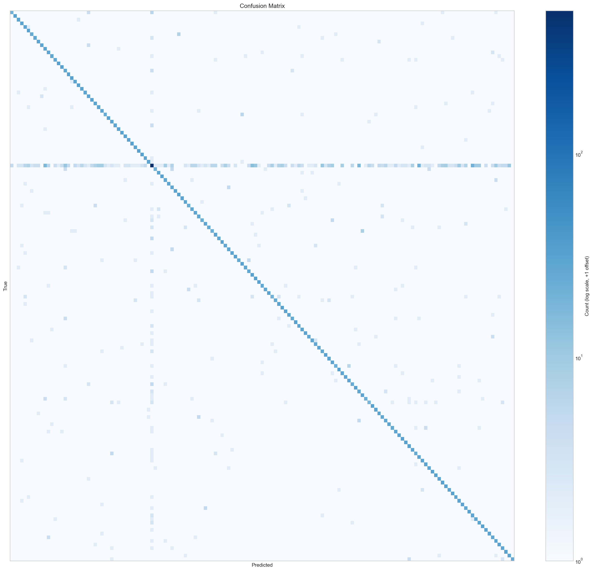

## Error Analysis Discussion

The following taxonomy, calibration and overlap diagnostics use one validation-selected representative run per model; they are not three-run aggregates.

### Error Taxonomy

- **TF-IDF + MLP**: dominant error category is `oos_as_inscope` (497 errors, 0.5648 of all errors) (outputs/shared/analysis/error_taxonomy_summary.json)
- **Text CNN**: dominant error category is `oos_as_inscope` (636 errors, 0.6310 of all errors) (outputs/shared/analysis/error_taxonomy_summary.json)
- **BiLSTM**: dominant error category is `oos_as_inscope` (716 errors, 0.5962 of all errors) (outputs/shared/analysis/error_taxonomy_summary.json)

Taxonomy labels are heuristics: `near_semantic_confusion` means a same-domain misclassification; `short_query_ambiguity` marks errors with at most 5 whitespace tokens. These rules do not establish semantic similarity or query ambiguity.

Related figure: `outputs/shared/analysis/error_taxonomy_comparison.png`

### Calibration and Confidence

Lowest representative-run ECE: Text CNN (0.0390). Highest: BiLSTM (0.1232) (outputs/shared/analysis/calibration_summary.json).

Related figures: `outputs/mlp/analysis/reliability_diagram.png`, `outputs/mlp/analysis/confidence_histogram.png`, `outputs/text_cnn/analysis/reliability_diagram.png`, `outputs/text_cnn/analysis/confidence_histogram.png`, `outputs/bilstm/analysis/reliability_diagram.png`, `outputs/bilstm/analysis/confidence_histogram.png`, `outputs/shared/analysis/calibration_comparison.png`

### OOS Detection Deep Dive

Highest representative-run OOS-probability AUROC: Text CNN (0.9491) (outputs/shared/analysis/oos_threshold_comparison.json). This ranking diagnostic is separate from aggregate argmax OOS F1.

Related figures: `outputs/mlp/analysis/oos_error_breakdown.png`, `outputs/text_cnn/analysis/oos_error_breakdown.png`, `outputs/bilstm/analysis/oos_error_breakdown.png`, `outputs/shared/analysis/oos_roc_comparison.png`, `outputs/shared/analysis/oos_error_comparison.png`

### Cross-Model Error Overlap

Of 5,500 test examples:
- All models correct: 4,011 (0.7293)
- All models wrong: 600 (0.1091)
- Model-specific errors: 489 (0.0889)
- Partial overlap: 400 (0.0727)

Of universally wrong examples, 0.3633 predict the same incorrect class (outputs/shared/analysis/cross_model_error_comparison.json). See also `outputs/shared/analysis/universally_misclassified_examples.csv`.

Related figure: `outputs/shared/analysis/cross_model_error_overlap.png`

### Worst-Class Analysis

Classes consistently worst across all models (shared): `oos`, `order`, `recipe`, `smart_home`, `yes` (outputs/shared/analysis/worst_classes_comparison.json).

Model-specific worst classes:
- **TF-IDF + MLP**: `calendar`, `how_busy`, `income`, `meal_suggestion`, `shopping_list`, `w2`
- **Text CNN**: `spending_history`, `todo_list_update`, `travel_suggestion`
- **BiLSTM**: `cancel`, `definition`, `play_music`, `shopping_list_update`, `whisper_mode`

Related figures: `outputs/mlp/analysis/worst_classes_confusion_heatmap.png`, `outputs/text_cnn/analysis/worst_classes_confusion_heatmap.png`, `outputs/bilstm/analysis/worst_classes_confusion_heatmap.png`

### Confused Pairs (OOS False-Accept Targets)

Intents that persistently capture OOS examples across 2+ models: `smart_home`, `directions`, `order`, `calculator`, `recipe`, `travel_suggestion` (outputs/shared/most_confused_pairs_table.json). Their domain assignments identify prediction targets, without proving the topics or intent of OOS queries.

Related figures: `outputs/mlp/figures/representative_top_confused_pairs.png`, `outputs/text_cnn/figures/representative_top_confused_pairs.png`, `outputs/bilstm/figures/representative_top_confused_pairs.png`

### Length and In-Scope / OOS Slices

The scope comparison separates in-scope classes from the supervised OOS class; it does not measure training frequency. Historical frequency_slice filenames are retained.

Short-query accuracy per model (representative run):
- **TF-IDF + MLP**: 0.8291
- **Text CNN**: 0.8641
- **BiLSTM**: 0.8019

(outputs/shared/analysis/error_analysis_summary.json)

Related figure: `outputs/shared/analysis/length_slice_comparison.png`

### Confusion Matrix

