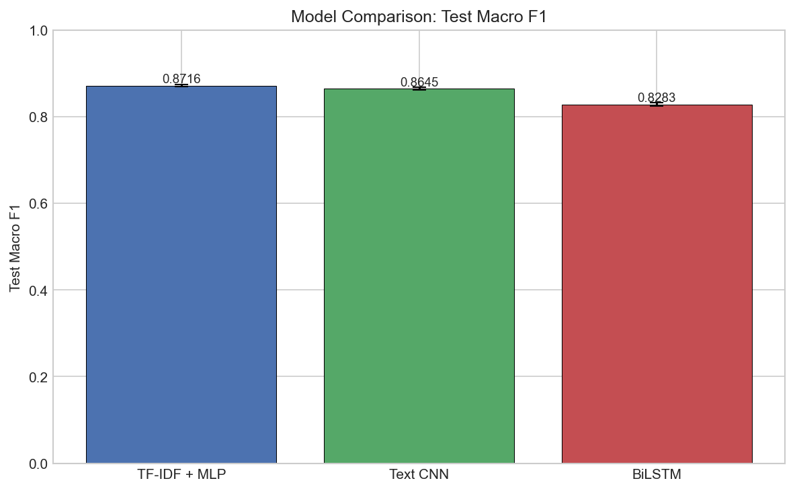
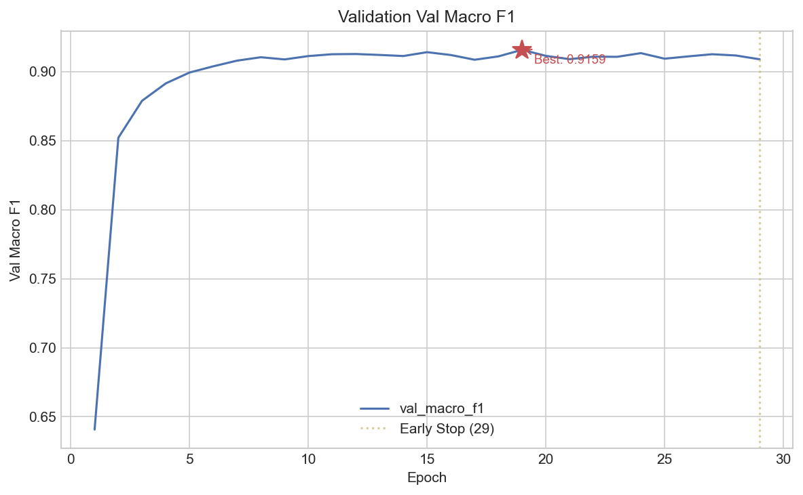
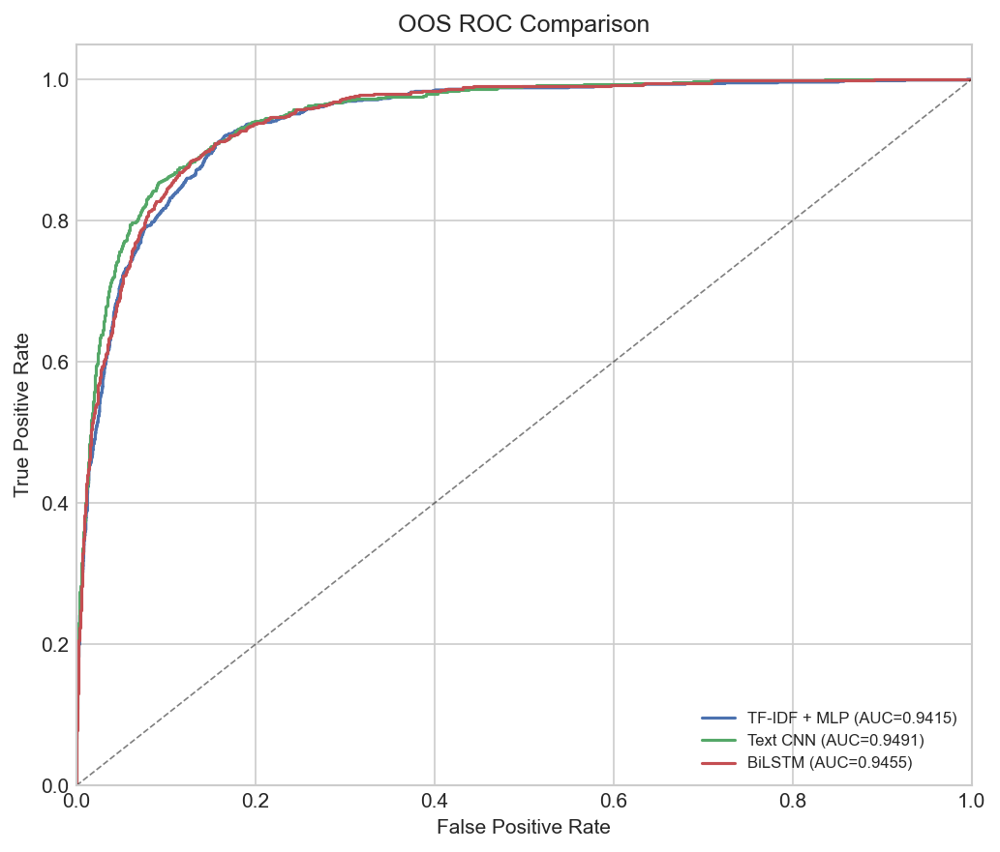

# Lightweight Deep Learning Models for Intent Classification and Out-of-Scope Detection on CLINC150

## Table of Contents

1. [Abstract](#abstract)
2. [Dataset Description](#dataset-description)
3. [Preprocessing Summary](#preprocessing-summary)
4. [Model Architectures](#model-architectures)
5. [Experimental Setup](#experimental-setup)
6. [Main Results](#main-results)
7. [OOS Detection Results](#oos-detection-results)
8. [Error Analysis Discussion](#error-analysis-discussion)
9. [Representative Examples](#representative-examples)
10. [Key Findings](#key-findings)
11. [Limitations](#limitations)
12. [Future Improvements](#future-improvements)
13. [Reproducibility](#reproducibility)
14. [Figure Catalogue](#figure-catalogue)

## Abstract

Evaluate lightweight deep learning models for intent classification and supervised out-of-scope (OOS) classification on the CLINC150 dataset.

Comparison of a sparse-feature baseline (TF-IDF + MLP), a convolutional sequence model (Text CNN), and a recurrent sequence model (BiLSTM).

OOS is a supervised 151st class with labeled training examples. These results describe this explicit-class setting and do not establish general open-set detection.

Three models are compared: TF-IDF + MLP, Text CNN, BiLSTM.

**Headline Result**: TF-IDF + MLP achieved the highest aggregate test macro F1 of 0.8716 +/- 0.0029 across 3 repeated runs (outputs/shared/model_comparison_aggregate.json).

**OOS Classification**: TF-IDF + MLP achieved the highest aggregate argmax OOS F1 of 0.6103 +/- 0.0352 (outputs/shared/oos_summary_table.json).

**Key Finding**: Focus on improving OOS detection and addressing semantically ambiguous intent pairs within the same domain. Consider intent merging for persistently confused pairs and confidence thresholding for high-confidence errors. (outputs/shared/analysis/error_analysis_summary.json).

Means and population standard deviations describe the recorded runs. They are descriptive dispersion measures, not confidence intervals or significance tests.

## Dataset Description

**Source**: `clinc/clinc_oos` (subset: `plus`) (data/artifacts/dataset_summary.json).

The dataset contains 151 intent classes (150 in-scope + 1 OOS). The OOS class uses label name `oos` (label ID 42).

OOS is a supervised 151st class with labeled training examples. These results describe this explicit-class setting and do not establish general open-set detection.

### Split Sizes

| Split      | Total  | In-Scope | OOS   |
| ---------- | ------ | -------- | ----- |
| Train      | 15,250 | 15,000   | 250   |
| Validation | 3,100  | 3,000    | 100   |
| Test       | 5,500  | 4,500    | 1,000 |

### Class Balance

In-scope classes are balanced in the `plus` subset at 100 training examples per class. OOS support varies across splits: train has 250 OOS examples (~1.6%), while test has 1000 OOS examples (~18.2%). OOS support is reported separately from in-scope class balance.

### Distribution Quirks

- Test split has ~18.2% OOS examples vs ~1.6% in train, creating a substantial distribution shift.
- In-scope classes are perfectly balanced in the 'plus' subset (100 training examples per class).
- OOS has 250 training examples, 2.50x the per-class in-scope training count (100).

The pinned official splits contain 3 normalized texts shared between train and validation and 2 shared between train and test. Two of the three train/validation overlaps and both train/test overlaps have conflicting labels. These are benchmark overlaps, separate from train-only preprocessing; official splits are preserved.

## Preprocessing Summary

**Source**: data/artifacts/preprocessing_summary.json

### Text Cleaning

Strategy: strip + normalize whitespace + optional lowercase. Preserves: punctuation, contractions, digits.

### Tokenization and Vocabulary

Tokenizer: whitespace split. Vocabulary size: 6161 (built from training data only). Special tokens: `<PAD>` = 0, `<UNK>` = 1.

### Sequence Handling

Max sequence length: 20. Statistics (training set): mean 8.32, median 8.0, p90 13, p95 14, max 28, min 1.

### OOV Rates

| Split      | Total Tokens | Unknown Tokens | OOV Rate |
| ---------- | ------------ | -------------- | -------- |
| Train      | 126,920      | 0              | 0.0000   |
| Validation | 25,674       | 868            | 0.0338   |
| Test       | 45,606       | 2,362          | 0.0518   |

### Truncation Rates

| Split      | Total Sequences | Truncated | Truncation Rate |
| ---------- | --------------- | --------- | --------------- |
| Train      | 15,250          | 32        | 0.0021          |
| Validation | 3,100           | 20        | 0.0065          |
| Test       | 5,500           | 10        | 0.0018          |

### TF-IDF Configuration

Max features: 10,000. N-gram range: (1, 2). Fitted on training data only. Note: TF-IDF is used only for the MLP baseline; Text CNN and BiLSTM use token-ID sequences.

## Model Architectures

### Unified Comparison

| Model        | Input Type         | Architecture                      | Params    | Trainable | Embed Dim | Dropout | Hidden Dim |
| ------------ | ------------------ | --------------------------------- | --------- | --------- | --------- | ------- | ---------- |
| TF-IDF + MLP | TF-IDF vectors     | 2-layer MLP (1 hidden layer)      | 5,197,975 | 5,197,975 | N/A       | 0.2     | 512        |
| Text CNN     | Token-ID sequences | Multi-kernel CNN (3 kernel sizes) | 1,930,167 | 1,930,167 | 256       | 0.5     | N/A        |
| BiLSTM       | Token-ID sequences | 2-layer bidirectional LSTM        | 4,284,311 | 4,284,311 | 256       | 0.3     | 256        |

### TF-IDF + MLP

Input: 10,000 TF-IDF features (10,000-dimensional). Single hidden layer with 512 units, ReLU activation, dropout 0.2.

### Text CNN

Embedding dimension: 256. Kernel sizes: [3, 4, 5] with 100 filters each. ReLU activation, max-over-time pooling, dropout 0.5. Trainable embeddings; sentence-CNN design follows [Kim (2014)](https://aclanthology.org/D14-1181/).

### BiLSTM

Embedding dimension: 256. Hidden dimension: 256, 2 layers, bidirectional. Summarization: concat_final_hidden. Gradient clipping (max norm 1.0). Dropout 0.3. Trainable embeddings.

The BiLSTM concatenates final forward/backward hidden states after processing the fixed right-PAD sequence. A zero PAD embedding does not mask recurrent transitions, so changing padding length can change logits. This representation is retained in the reported experiment.

## Experimental Setup

**Source**: outputs/shared/evaluation_protocol.json

### Evaluation Protocol

Repeated-run evaluation with 3 seeds: [42, 1337, 2024]. Representative run selection: highest_validation_macro_f1 (highest validation macro F1).

Means and population standard deviations describe the recorded runs. They are descriptive dispersion measures, not confidence intervals or significance tests.

### Training Configuration

- **Optimizer**: Adam (all models)
- **Learning rate**: TF-IDF + MLP: 0.0005, Text CNN: 0.001, BiLSTM: 0.001
- **Weight decay**: TF-IDF + MLP: 0.0001, Text CNN: 0.0001, BiLSTM: 0.0
- **Batch size**: 64
- **Max epochs**: 100
- **Early stopping**: patience 10, monitoring val_macro_f1
- **Seed behavior**: Each run copies the frozen model configuration with `random_seed = seed` and `dataloader_seed = seed + 1`. The training seed controls initialization and training randomness; the dataloader seed controls train-batch shuffling.

Final evaluations reuse frozen hyperparameters from limited model-specific searches. The original tuning reused advancing loader RNG state across trials, and neural smoke checks also consumed a train shuffle, making trial order part of that search. Preprocessing and tuning budgets differ across models; this compares complete pipelines rather than isolating architecture.

### Metric Definitions

- **accuracy**: overall accuracy (correct / total)
- **macro_f1**: macro-averaged F1 across all classes including OOS
- **precision**: macro-averaged precision across all classes including OOS
- **recall**: macro-averaged recall across all classes including OOS
- **oos_precision**: one-vs-rest precision for OOS class
- **oos_recall**: one-vs-rest recall for OOS class
- **oos_f1**: one-vs-rest F1 for OOS class
- **zero_division_policy**: zero_division=0 (sklearn convention)
- **value_range**: [0.0, 1.0] (raw ratios, not percentages)

### OOS Evaluation Policy

- OOS class: `oos` (label ID 42)
- Method: explicit_class
- Rule: oos is the positive class; all in-scope labels are negative

OOS is a supervised 151st class with labeled training examples. These results describe this explicit-class setting and do not establish general open-set detection.

Aggregate OOS precision/recall/F1 use the 151-class argmax prediction. Probability-based AUROC and calibration diagnostics use one validation-selected representative run per model, without averaging across seeds.

### Timing and Device

Timing includes DataLoader overhead: True. Automatic device selection checks MPS, then CUDA, then CPU. Refreshed run metadata records the actual device, hardware model, processor and RAM; historical metadata may lack these fields.

Batched evaluation timing covers loader traversal, device transfer, forward pass, softmax and CPU result collection; it excludes preprocessing, checkpoint loading, array concatenation, metrics and artifact writes. The per-example figures describe batched throughput, with no controlled warmup or repeated timing trials; single-query deployment latency was not measured.

## Main Results

Means and population standard deviations describe the recorded runs. They are descriptive dispersion measures, not confidence intervals or significance tests.

### Table 1: Main Model Comparison

*Aggregate over 3 runs (mean +/- std)*

| Model        | Test Accuracy     | Test Macro F1     | Test Precision    | Test Recall       |
| ------------ | ----------------- | ----------------- | ----------------- | ----------------- |
| TF-IDF + MLP | 0.8345 +/- 0.0063 | 0.8716 +/- 0.0029 | 0.8439 +/- 0.0059 | 0.9132 +/- 0.0014 |
| Text CNN     | 0.8210 +/- 0.0067 | 0.8645 +/- 0.0031 | 0.8299 +/- 0.0050 | 0.9153 +/- 0.0012 |
| BiLSTM       | 0.7744 +/- 0.0065 | 0.8283 +/- 0.0046 | 0.7944 +/- 0.0074 | 0.8844 +/- 0.0040 |

TF-IDF + MLP achieved the highest aggregate test macro F1 (0.8716 +/- 0.0029).

Related figure: `outputs/shared/figures/model_comparison_test_macro_f1.png`

### Table 2: OOS Detection Metrics

*Aggregate over 3 runs (mean +/- std)*

OOS precision/recall/F1 score argmax predictions in the supervised 151-class classifier.

| Model        | OOS Precision     | OOS Recall        | OOS F1            |
| ------------ | ----------------- | ----------------- | ----------------- |
| TF-IDF + MLP | 0.8877 +/- 0.0112 | 0.4667 +/- 0.0425 | 0.6103 +/- 0.0352 |
| Text CNN     | 0.9326 +/- 0.0145 | 0.3810 +/- 0.0375 | 0.5397 +/- 0.0357 |
| BiLSTM       | 0.8865 +/- 0.0203 | 0.2610 +/- 0.0406 | 0.4019 +/- 0.0511 |

TF-IDF + MLP achieved the highest aggregate argmax OOS F1 (0.6103 +/- 0.0352).

Related figure: `outputs/shared/figures/oos_metrics_comparison.png`

### Table 3: Extended Metrics

*Representative run only (single seed)*

| Model        | Macro F1 | Micro F1 | Weighted F1 | Macro Precision | Macro Recall |
| ------------ | -------- | -------- | ----------- | --------------- | ------------ |
| TF-IDF + MLP | 0.8742   | 0.8400   | 0.8326      | 0.8492          | 0.9122       |
| Text CNN     | 0.8628   | 0.8167   | 0.8027      | 0.8290          | 0.9137       |
| BiLSTM       | 0.8347   | 0.7816   | 0.7639      | 0.8037          | 0.8882       |

TF-IDF + MLP has the highest representative-run macro F1 (0.8742) in the extended-metrics table.

### Table 4: Calibration Metrics

*Representative run only (single seed)*

| Model        | ECE    | MCE    | Brier Score | NLL    |
| ------------ | ------ | ------ | ----------- | ------ |
| TF-IDF + MLP | 0.1027 | 0.2580 | 0.2532      | 0.7303 |
| Text CNN     | 0.0390 | 0.1772 | 0.2595      | 0.9015 |
| BiLSTM       | 0.1232 | 0.4381 | 0.3345      | 1.3284 |

Text CNN is the best calibrated representative run (ECE = 0.0390).

Related figure: `outputs/shared/analysis/calibration_comparison.png`

### Table 5: Efficiency Comparison

*Aggregate over 3 runs (mean +/- std)*

| Model        | Parameters | Training Time (s) | Inference (ms/example) | Throughput (ex/s)    |
| ------------ | ---------- | ----------------- | ---------------------- | -------------------- |
| TF-IDF + MLP | 5,197,975  | 82.69 +/- 6.85    | 0.0557 +/- 0.0048      | 18069.35 +/- 1459.73 |
| Text CNN     | 1,930,167  | 168.54 +/- 18.36  | 0.0353 +/- 0.0023      | 28455.69 +/- 1795.24 |
| BiLSTM       | 4,284,311  | 144.16 +/- 18.48  | 0.1281 +/- 0.0150      | 7909.59 +/- 862.64   |

Text CNN has the highest mean inference throughput (28456 ex/s).

Batched evaluation timing covers loader traversal, device transfer, forward pass, softmax and CPU result collection; it excludes preprocessing, checkpoint loading, array concatenation, metrics and artifact writes. The per-example figures describe batched throughput, with no controlled warmup or repeated timing trials; single-query deployment latency was not measured.

Related figure: `outputs/shared/figures/model_efficiency_comparison.png`

### Key Figures





## OOS Detection Results

OOS is a supervised 151st class with labeled training examples. These results describe this explicit-class setting and do not establish general open-set detection.

### Aggregate OOS Metrics

*Aggregate over 3 runs (mean +/- std)*

| Model        | OOS Precision     | OOS Recall        | OOS F1            |
| ------------ | ----------------- | ----------------- | ----------------- |
| TF-IDF + MLP | 0.8877 +/- 0.0112 | 0.4667 +/- 0.0425 | 0.6103 +/- 0.0352 |
| Text CNN     | 0.9326 +/- 0.0145 | 0.3810 +/- 0.0375 | 0.5397 +/- 0.0357 |
| BiLSTM       | 0.8865 +/- 0.0203 | 0.2610 +/- 0.0406 | 0.4019 +/- 0.0511 |

TF-IDF + MLP achieved the highest aggregate argmax OOS F1 (0.6103 +/- 0.0352).

Related figure: `outputs/shared/figures/oos_metrics_comparison.png`

### OOS Threshold Analysis

*Representative run only (single seed)*

| Model        | AUROC  | AUPR   | FPR@95TPR | FPR@90TPR | MSP AUROC | MSP AUPR |
| ------------ | ------ | ------ | --------- | --------- | --------- | -------- |
| TF-IDF + MLP | 0.9415 | 0.7984 | 0.2389    | 0.1531    | 0.8901    | 0.6180   |
| Text CNN     | 0.9491 | 0.8273 | 0.2322    | 0.1458    | 0.9029    | 0.6423   |
| BiLSTM       | 0.9455 | 0.8050 | 0.2367    | 0.1478    | 0.8799    | 0.5819   |

Text CNN has the highest representative-run OOS-probability AUROC (0.9491) among the compared runs. (outputs/shared/analysis/oos_threshold_comparison.json). This probability ranking measures different behavior from aggregate argmax OOS F1.

The MSP diagnostic uses `1 - max(p)` over all 151 softmax classes, including OOS. A confidently correct OOS prediction can therefore receive a low MSP OOS score. This is a diagnostic of the supervised classifier, rather than a conventional in-scope-only MSP detector.

FPR@95TPR and FPR@90TPR are descriptive points on the representative test ROC curve. They do not establish a deployable operating point: thresholds and calibration must be selected on validation data before separate held-out evaluation.

Related figures: `outputs/shared/analysis/oos_roc_comparison.png`, `outputs/shared/analysis/oos_pr_comparison.png`

### OOS Distribution Challenge

The test split contains ~18% OOS examples versus ~1.6% in training, with 250 labeled OOS training examples and 1,000 OOS test examples. Interpret the observed precision and recall within this benchmark support pattern.

### False-Accept Patterns

- **TF-IDF + MLP**: 497 false accepts. Top capturing intents: `w2` (19), `calculator` (19), `recipe` (16)
- **Text CNN**: 636 false accepts. Top capturing intents: `directions` (33), `recipe` (25), `todo_list` (24)
- **BiLSTM**: 716 false accepts. Top capturing intents: `order` (48), `smart_home` (32), `whisper_mode` (27)

The representative-run false-accept counts identify in-scope intents that capture labeled OOS examples. (outputs/shared/analysis/oos_false_accept_comparison.json).

Related figure: `outputs/shared/analysis/oos_error_comparison.png`



## Error Analysis Discussion

The following taxonomy, calibration and overlap diagnostics use one validation-selected representative run per model; they are not three-run aggregates.

### Error Taxonomy

- **TF-IDF + MLP**: dominant error category is `oos_as_inscope` (497 errors, 0.5648 of all errors) (outputs/shared/analysis/error_taxonomy_summary.json)
- **Text CNN**: dominant error category is `oos_as_inscope` (636 errors, 0.6310 of all errors) (outputs/shared/analysis/error_taxonomy_summary.json)
- **BiLSTM**: dominant error category is `oos_as_inscope` (716 errors, 0.5962 of all errors) (outputs/shared/analysis/error_taxonomy_summary.json)

Taxonomy labels are heuristics: `near_semantic_confusion` means a same-domain misclassification; `short_query_ambiguity` marks errors with at most 5 whitespace tokens. These rules do not establish semantic similarity or query ambiguity.

Related figure: `outputs/shared/analysis/error_taxonomy_comparison.png`

### Calibration and Confidence

Lowest representative-run ECE: Text CNN (0.0390). Highest: BiLSTM (0.1232) (outputs/shared/analysis/calibration_summary.json).

Related figures: `outputs/mlp/analysis/reliability_diagram.png`, `outputs/mlp/analysis/confidence_histogram.png`, `outputs/text_cnn/analysis/reliability_diagram.png`, `outputs/text_cnn/analysis/confidence_histogram.png`, `outputs/bilstm/analysis/reliability_diagram.png`, `outputs/bilstm/analysis/confidence_histogram.png`, `outputs/shared/analysis/calibration_comparison.png`

### OOS Detection Deep Dive

Highest representative-run OOS-probability AUROC: Text CNN (0.9491) (outputs/shared/analysis/oos_threshold_comparison.json). This ranking diagnostic is separate from aggregate argmax OOS F1.

Related figures: `outputs/mlp/analysis/oos_error_breakdown.png`, `outputs/text_cnn/analysis/oos_error_breakdown.png`, `outputs/bilstm/analysis/oos_error_breakdown.png`, `outputs/shared/analysis/oos_roc_comparison.png`, `outputs/shared/analysis/oos_error_comparison.png`

### Cross-Model Error Overlap

Of 5,500 test examples:
- All models correct: 4,011 (0.7293)
- All models wrong: 600 (0.1091)
- Model-specific errors: 489 (0.0889)
- Partial overlap: 400 (0.0727)

Of universally wrong examples, 0.3633 predict the same incorrect class (outputs/shared/analysis/cross_model_error_comparison.json). See also `outputs/shared/analysis/universally_misclassified_examples.csv`.

Related figure: `outputs/shared/analysis/cross_model_error_overlap.png`

### Worst-Class Analysis

Classes consistently worst across all models (shared): `oos`, `order`, `recipe`, `smart_home`, `yes` (outputs/shared/analysis/worst_classes_comparison.json).

Model-specific worst classes:
- **TF-IDF + MLP**: `calendar`, `how_busy`, `income`, `meal_suggestion`, `shopping_list`, `w2`
- **Text CNN**: `spending_history`, `todo_list_update`, `travel_suggestion`
- **BiLSTM**: `cancel`, `definition`, `play_music`, `shopping_list_update`, `whisper_mode`

Related figures: `outputs/mlp/analysis/worst_classes_confusion_heatmap.png`, `outputs/text_cnn/analysis/worst_classes_confusion_heatmap.png`, `outputs/bilstm/analysis/worst_classes_confusion_heatmap.png`

### Confused Pairs (OOS False-Accept Targets)

Intents that persistently capture OOS examples across 2+ models: `smart_home`, `directions`, `order`, `calculator`, `recipe`, `travel_suggestion` (outputs/shared/most_confused_pairs_table.json). Their domain assignments identify prediction targets, without proving the topics or intent of OOS queries.

Related figures: `outputs/mlp/figures/representative_top_confused_pairs.png`, `outputs/text_cnn/figures/representative_top_confused_pairs.png`, `outputs/bilstm/figures/representative_top_confused_pairs.png`

### Length and In-Scope / OOS Slices

The scope comparison separates in-scope classes from the supervised OOS class; it does not measure training frequency. Historical frequency_slice filenames are retained.

Short-query accuracy per model (representative run):
- **TF-IDF + MLP**: 0.8291
- **Text CNN**: 0.8641
- **BiLSTM**: 0.8019

(outputs/shared/analysis/error_analysis_summary.json)

Related figure: `outputs/shared/analysis/length_slice_comparison.png`

### Confusion Matrix


## Representative Examples

*Representative run only (single seed)*

Examples selected to cover key error patterns: at least 3 OOS false accepts, 3 same-domain confusions, 3 cross-domain confusions, 3 short-query tagged errors, and 2+ examples per model. Sorted by category then confidence.

Taxonomy labels are heuristics: `near_semantic_confusion` means a same-domain misclassification; `short_query_ambiguity` marks errors with at most 5 whitespace tokens. These rules do not establish semantic similarity or query ambiguity.

### Coverage in Selected Examples

- Selected examples include 12 OOS false-accept cases.
- Selected examples include 5 same-domain cases tagged `near_semantic_confusion`.
- Selected examples include 7 cross-domain confusion cases.
- Selected examples include 0 short-query tagged errors.

Related figures: `outputs/mlp/analysis/oos_error_breakdown.png`, `outputs/text_cnn/analysis/oos_error_breakdown.png`, `outputs/bilstm/analysis/oos_error_breakdown.png`, `outputs/shared/analysis/oos_error_comparison.png`

Related figures: `outputs/mlp/figures/representative_confusion_matrix.png`, `outputs/mlp/figures/representative_top_confused_pairs.png`, `outputs/text_cnn/figures/representative_confusion_matrix.png`, `outputs/text_cnn/figures/representative_top_confused_pairs.png`, `outputs/bilstm/figures/representative_confusion_matrix.png`, `outputs/bilstm/figures/representative_top_confused_pairs.png`

Related figures: `outputs/mlp/figures/representative_error_summary.png`, `outputs/text_cnn/figures/representative_error_summary.png`, `outputs/bilstm/figures/representative_error_summary.png`, `outputs/shared/analysis/cross_model_error_overlap.png`

Related figure: `outputs/shared/analysis/length_slice_comparison.png`

| Text                                                            | True Label           | Predicted             | Model        | Confidence | Category                | Annotation             |
| --------------------------------------------------------------- | -------------------- | --------------------- | ------------ | ---------- | ----------------------- | ---------------------- |
| give me the weather forecast for today                          | oos                  | weather               | BiLSTM       | 1.0000     | oos_as_inscope          | confident false accept |
| look up the conversion rate for the euro to dollar exchange     | oos                  | exchange_rate         | BiLSTM       | 1.0000     | oos_as_inscope          | confident false accept |
| what other countries speak the english language                 | oos                  | change_language       | BiLSTM       | 1.0000     | oos_as_inscope          | confident false accept |
| can you tell me what the best places are to look for a job o... | oos                  | restaurant_suggestion | BiLSTM       | 1.0000     | oos_as_inscope          | confident false accept |
| give me the weather forecast for today                          | oos                  | weather               | Text CNN     | 1.0000     | oos_as_inscope          | confident false accept |
| i need you to order a new pair of eyeglasses for me             | oos                  | order                 | BiLSTM       | 1.0000     | oos_as_inscope          | confident false accept |
| please read the text message i just received                    | oos                  | text                  | Text CNN     | 0.9997     | oos_as_inscope          | confident false accept |
| what other countries speak the english language                 | oos                  | change_language       | Text CNN     | 0.9991     | oos_as_inscope          | confident false accept |
| what's the current prevailing interest rate for mortgages in... | oos                  | interest_rate         | Text CNN     | 0.9990     | oos_as_inscope          | confident false accept |
| forward the text i just got from henry to giselle               | oos                  | text                  | Text CNN     | 0.9988     | oos_as_inscope          | confident false accept |
| ignore call                                                     | oos                  | make_call             | TF-IDF + MLP | 0.9980     | oos_as_inscope          | confident false accept |
| deny incoming phone call                                        | oos                  | make_call             | TF-IDF + MLP | 0.9972     | oos_as_inscope          | confident false accept |
| give me a recipe for tacos                                      | ingredients_list     | recipe                | BiLSTM       | 1.0000     | near_semantic_confusion | semantic overlap       |
| what's a good recipe foe tacos                                  | ingredients_list     | recipe                | BiLSTM       | 1.0000     | near_semantic_confusion | semantic overlap       |
| what is the next date for which i can get an oil change appo... | schedule_maintenance | oil_change_when       | BiLSTM       | 1.0000     | near_semantic_confusion | semantic overlap       |
| what are the steps to get my rewards for my visa card           | redeem_rewards       | rewards_balance       | BiLSTM       | 0.9999     | near_semantic_confusion | semantic overlap       |
| what have i spent things on                                     | transactions         | spending_history      | BiLSTM       | 0.9999     | near_semantic_confusion | semantic overlap       |
| repeat what the weather will be like                            | transfer             | weather               | BiLSTM       | 1.0000     | cross_domain_confusion  | cross-domain mix-up    |
| i'd like for this person to know my location                    | share_location       | current_location      | BiLSTM       | 1.0000     | cross_domain_confusion  | cross-domain mix-up    |
| what time is it in phoenix                                      | timezone             | time                  | BiLSTM       | 1.0000     | cross_domain_confusion  | cross-domain mix-up    |
| when will my payment be deposited                               | payday               | bill_due              | BiLSTM       | 1.0000     | cross_domain_confusion  | cross-domain mix-up    |
| what is my current location                                     | share_location       | current_location      | BiLSTM       | 0.9999     | cross_domain_confusion  | cross-domain mix-up    |
| what is my current location                                     | share_location       | current_location      | Text CNN     | 0.9988     | cross_domain_confusion  | cross-domain mix-up    |
| what time is it in phoenix                                      | timezone             | time                  | Text CNN     | 0.9987     | cross_domain_confusion  | cross-domain mix-up    |
| how many minutes are involved in the preparation of curry       | cook_time            | oos                   | BiLSTM       | 1.0000     | inscope_as_oos          | false rejection        |

Total curated examples: 60; selected for report: 25 (outputs/shared/analysis/curated_report_examples.json).

## Key Findings

Means and population standard deviations describe the recorded runs. They are descriptive dispersion measures, not confidence intervals or significance tests.

Calibration, OOS-probability ranking and qualitative findings use one validation-selected representative run per model. Differences in preprocessing and search budgets prevent an architecture-only causal interpretation.

1. **Headline**: TF-IDF + MLP achieved the best aggregate test macro F1 of 0.8716 +/- 0.0029 (outputs/shared/model_comparison_aggregate.json)
Related figure: `outputs/shared/figures/model_comparison_test_macro_f1.png`

2. **Calibration**: Lowest representative-run ECE: text_cnn (0.0390). Highest: bilstm (0.1232) (outputs/shared/analysis/calibration_summary.json)
Related figure: `outputs/shared/analysis/calibration_comparison.png`

3. **Oos Detection**: Text CNN has the highest representative-run OOS-probability AUROC (0.9491), with AUPR = 0.8273 (outputs/shared/analysis/oos_threshold_comparison.json)
Related figures: `outputs/shared/analysis/oos_roc_comparison.png`, `outputs/shared/analysis/oos_pr_comparison.png`

4. **Confusion**: Representative-run dominant heuristic category per model: TF-IDF + MLP: oos_as_inscope, Text CNN: oos_as_inscope, BiLSTM: oos_as_inscope (outputs/shared/analysis/error_taxonomy_summary.json)
Related figures: `outputs/mlp/figures/representative_top_confused_pairs.png`, `outputs/text_cnn/figures/representative_top_confused_pairs.png`, `outputs/bilstm/figures/representative_top_confused_pairs.png`, `outputs/shared/analysis/error_taxonomy_comparison.png`

5. **Architecture**: 600 examples (0.1091) misclassified by all models; 489 (0.0889) unique to one model. Agreement on wrong class: 0.3633 (outputs/shared/analysis/cross_model_error_comparison.json)
Related figure: `outputs/shared/analysis/cross_model_error_overlap.png`

6. **Length**: Short-query accuracy: TF-IDF + MLP 0.8291, Text CNN 0.8641, BiLSTM 0.8019 (outputs/shared/analysis/error_analysis_summary.json)
Related figure: `outputs/shared/analysis/length_slice_comparison.png`

7. **Efficiency**: Parameter counts: TF-IDF + MLP 5,197,975, Text CNN 1,930,167, BiLSTM 4,284,311. Inference throughput: TF-IDF + MLP 18069 ex/s, Text CNN 28456 ex/s, BiLSTM 7910 ex/s (outputs/shared/efficiency_summary_table.json)
Related figure: `outputs/shared/figures/model_efficiency_comparison.png`

8. **Recommendation**: Focus on improving OOS detection and addressing semantically ambiguous intent pairs within the same domain. Consider intent merging for persistently confused pairs and confidence thresholding for high-confidence errors. (outputs/shared/analysis/error_analysis_summary.json)
Related figures: `outputs/mlp/figures/representative_top_confused_pairs.png`, `outputs/text_cnn/figures/representative_top_confused_pairs.png`, `outputs/bilstm/figures/representative_top_confused_pairs.png`, `outputs/shared/analysis/oos_error_comparison.png`

## Limitations

### Analysis-Level Limitations

- Qualitative, calibration and probability-ranking diagnostics use one validation-selected representative run per model, without measuring their variability across seeds.
- Only the 150 in-scope classes are balanced. The OOS class has 250 training and 1,000 test examples; these supports differ from each in-scope class and from many deployment distributions.
- Taxonomy labels are heuristics: `near_semantic_confusion` means a same-domain misclassification; `short_query_ambiguity` marks errors with at most 5 whitespace tokens. These rules do not establish semantic similarity or query ambiguity.
- Post-hoc calibration was not applied. Test-derived ROC points do not establish validation-selected thresholds or a deployable operating point.
- Length slices use whitespace tokenization; scope slices compare supervised in-scope and OOS classes, not training frequency.

### Project-Level Limitations

- Single benchmark only (CLINC150), with no cross-dataset or domain-transfer evaluation. Its official normalized splits contain 3 train/validation text overlaps (2 with conflicting labels) and 2 train/test overlaps (both with conflicting labels); splits are preserved.
- OOS is a supervised 151st class with labeled training examples. These results describe this explicit-class setting and do not establish general open-set detection.
- Models use different representations and search budgets. Neural models use whitespace tokens and embeddings trained from scratch; no pretrained embeddings or transformers were compared.
- The BiLSTM processes fixed right-PAD positions and concatenates final hidden states. Recurrent transitions remain active on PAD tokens, making the representation sensitive to padding length.
- Means and population standard deviations describe the recorded runs. They are descriptive dispersion measures, not confidence intervals or significance tests.
- Frozen hyperparameters come from limited earlier searches. Advancing tuning-loader RNG state and neural smoke checks made the original trial order part of the search; fair seeded loaders would require new experiments.
- Batched evaluation timing covers loader traversal, device transfer, forward pass, softmax and CPU result collection; it excludes preprocessing, checkpoint loading, array concatenation, metrics and artifact writes. The per-example figures describe batched throughput, with no controlled warmup or repeated timing trials; single-query deployment latency was not measured.
- Model checkpoints not committed to repository; reproduction requires retraining.

## Future Improvements

### High Priority

- **Evaluate additional labeled OOS training data in a separate experiment**: Observed false accepts motivate testing broader OOS coverage; document any new data protocol and retain the current official benchmark for comparability.
- **Manually inspect persistent same-domain confusions**: Domain-based taxonomy tags are heuristics. Inspect examples before drawing semantic conclusions; preserve official benchmark labels in the current comparison.
- **Select OOS or abstention thresholds on validation data**: Specify a target trade-off on validation data and evaluate the fixed threshold on held-out data. Test ROC operating points alone do not establish deployment behavior.
- **Evaluate temperature scaling for post-hoc calibration improvement**: Fit temperature scaling on validation data, then compare held-out calibration. Representative-run ECE differences alone do not establish its benefit across seeds.

### Medium Priority

- **Use fresh seeded loaders for each tuning trial**: Make comparisons independent of advancing loader state and smoke-check shuffles. Changing this search policy requires new tuning and final evaluations.
- **Evaluate length-aware BiLSTM sequence handling**: Packed sequences or length-aware summaries could avoid processing right-PAD positions. This modeling change requires new training, tuning and comparisons.
- **Evaluate pretrained word embeddings**: Test their effect on the neural pipelines through new training and tuning rather than assuming improved generalization.
- **Measure controlled deployment latency separately**: Use a specified device, warmup and repeated single-query measurements before making service-latency claims from batch throughput.

### Lower Priority / Future Work

- **Compare against transformer-based models (DistilBERT, BERT-base)**: Add a separately trained and tuned reference with its own preprocessing and compute budget.
- **Evaluate on additional intent-classification datasets**: Validate whether findings generalize beyond CLINC150.
- **Subword tokenization (BPE, WordPiece) for better OOV handling**: Reduce OOV rates and improve generalization to unseen vocabulary.
- **Evaluate a conventional in-scope-only MSP baseline**: Train a separate classifier without the supervised OOS class; its uncertainty score answers a different question from the current 151-class MSP diagnostic.
- **Expand independently seeded runs and design uncertainty estimates**: Distinguish test-example sampling uncertainty from training-run variation; three seeds and overlapping mean/std ranges alone do not justify significance claims.

(outputs/shared/analysis/error_analysis_summary.json)

## Reproducibility

### Environment Setup

- Python version: >=3.11
- Install from the repository root: `uv sync --frozen`
- Secondary route: activate a virtual environment, then `python -m pip install -r requirements.txt`. The portable export includes `-e .` to install the project.
- Pinned dependency versions available: `uv.lock`
- PyTorch with MPS support for Apple Silicon (optional; CPU fallback available)

### Dataset Acquisition

CLINC150 is loaded via the HuggingFace `datasets` library (`clinc/clinc_oos`, `plus` subset). The configured revision is pinned and future runs record ordered split hashes. The first uncached download requires network access; official split membership is preserved.

### Frozen Final Evaluations and Report

```bash
uv run --frozen python scripts/run_repeated_evaluation.py --model all --run-count 3
uv run --frozen python scripts/run_experiment_tracking.py
uv run --frozen python scripts/run_report_figures.py
uv run --frozen python scripts/run_error_analysis.py
uv run --frozen python scripts/run_report_generation.py
```

Seeds: [42, 1337, 2024]

To rebuild preprocessing from source first run `uv run --frozen python scripts/explore_dataset.py` and `uv run --frozen python scripts/run_preprocessing.py`. The evaluation commands reuse existing frozen hyperparameters; they do not retune. See the repository README for explicit tuning-source selection.

### Expected Output Structure

```
outputs/
  mlp/           # MLP model artifacts (tuning, final_runs, aggregate, figures, analysis)
  text_cnn/      # Text CNN model artifacts
  bilstm/        # BiLSTM model artifacts
  shared/        # Cross-model comparisons, figures, analysis, report
```

### Approximate Runtime

- **TF-IDF + MLP** (3 runs): ~4.1 min (training only; 82.69 s/run)
- **Text CNN** (3 runs): ~8.4 min (training only; 168.54 s/run)
- **BiLSTM** (3 runs): ~7.2 min (training only; 144.16 s/run)

Hardware, device, source commit, input hashes and effective settings are recorded per run. These times cover the training loop including validation/checkpoint writes, excluding setup, preprocessing, neural smoke checks, tuning and final training-log serialization. Refreshed runs use `time.perf_counter` and record the exact hardware model, processor and RAM in `run_metadata.json`; historical outputs without these identities remain explicitly unknown.

Batched evaluation timing covers loader traversal, device transfer, forward pass, softmax and CPU result collection; it excludes preprocessing, checkpoint loading, array concatenation, metrics and artifact writes. The per-example figures describe batched throughput, with no controlled warmup or repeated timing trials; single-query deployment latency was not measured.

### Nondeterminism Notes

- MPS backend nondeterminism on Apple Silicon (PyTorch does not guarantee deterministic MPS operations).
- DataLoaders use num_workers=0 and the recorded per-run shuffle seed.
- Exact numeric reproduction across different hardware is not guaranteed.

### Reproduction Checklist

1. Clone https://github.com/alexiwoh/clinc150-project into a separate checkout; generated outputs are replaced in place.
2. Install locked dependencies from the repository root with `uv sync --frozen`.
3. Run frozen final evaluations, then tracking, report figures, error analysis and report generation.
4. For source reconstruction, rebuild dataset summaries and train-only preprocessing before evaluation.
5. Run offline tests with `uv run --frozen pytest -q`; generated-artifact checks require trained checkpoints.
6. Verify outputs exist under `outputs/` with the expected directory structure

### References and Licensing

- [Larson et al. (2019), An Evaluation Dataset for Intent Classification and Out-of-Scope Prediction](https://aclanthology.org/D19-1131/)
- [Kim (2014), Convolutional Neural Networks for Sentence Classification](https://aclanthology.org/D14-1181/)
- [CLINC150 dataset card](https://huggingface.co/datasets/clinc/clinc_oos)
- [GPLv3 source license](../../../LICENSE)

The CLINC150 dataset card metadata lists CC BY 3.0 for the dataset. Dataset licensing is separate from this repository's GPLv3 source license. The sentence-CNN design follows Kim (2014); the benchmark is attributed to Larson et al. (2019).

## Figure Catalogue

### Training Diagnostics

- **train_val_loss_curve** (representative): Training and validation loss by epoch for TF-IDF + MLP. Computed from representative run `run_01_seed_42`, selected by highest validation macro f1. Uses the CLINC150 validation split.
  Figure path: `outputs/mlp/figures/representative_train_val_loss_curve.png`
  Source artifacts: `outputs/mlp/final_runs/run_01_seed_42/epoch_history.json`
- **val_macro_f1_curve** (representative): Validation macro F1 by training epoch for TF-IDF + MLP. Computed from representative run `run_01_seed_42`, selected by highest validation macro f1. Uses the CLINC150 validation split.
  Figure path: `outputs/mlp/figures/representative_val_macro_f1_curve.png`
  Source artifacts: `outputs/mlp/final_runs/run_01_seed_42/epoch_history.json`
- **val_accuracy_curve** (representative): Validation accuracy by training epoch for TF-IDF + MLP. Computed from representative run `run_01_seed_42`, selected by highest validation macro f1. Uses the CLINC150 validation split.
  Figure path: `outputs/mlp/figures/representative_val_accuracy_curve.png`
  Source artifacts: `outputs/mlp/final_runs/run_01_seed_42/epoch_history.json`
- **train_val_loss_curve** (representative): Training and validation loss by epoch for Text CNN. Computed from representative run `run_03_seed_2024`, selected by highest validation macro f1. Uses the CLINC150 validation split.
  Figure path: `outputs/text_cnn/figures/representative_train_val_loss_curve.png`
  Source artifacts: `outputs/text_cnn/final_runs/run_03_seed_2024/epoch_history.json`
- **val_macro_f1_curve** (representative): Validation macro F1 by training epoch for Text CNN. Computed from representative run `run_03_seed_2024`, selected by highest validation macro f1. Uses the CLINC150 validation split.
  Figure path: `outputs/text_cnn/figures/representative_val_macro_f1_curve.png`
  Source artifacts: `outputs/text_cnn/final_runs/run_03_seed_2024/epoch_history.json`
- **val_accuracy_curve** (representative): Validation accuracy by training epoch for Text CNN. Computed from representative run `run_03_seed_2024`, selected by highest validation macro f1. Uses the CLINC150 validation split.
  Figure path: `outputs/text_cnn/figures/representative_val_accuracy_curve.png`
  Source artifacts: `outputs/text_cnn/final_runs/run_03_seed_2024/epoch_history.json`
- **train_val_loss_curve** (representative): Training and validation loss by epoch for BiLSTM. Computed from representative run `run_02_seed_1337`, selected by highest validation macro f1. Uses the CLINC150 validation split.
  Figure path: `outputs/bilstm/figures/representative_train_val_loss_curve.png`
  Source artifacts: `outputs/bilstm/final_runs/run_02_seed_1337/epoch_history.json`
- **val_macro_f1_curve** (representative): Validation macro F1 by training epoch for BiLSTM. Computed from representative run `run_02_seed_1337`, selected by highest validation macro f1. Uses the CLINC150 validation split.
  Figure path: `outputs/bilstm/figures/representative_val_macro_f1_curve.png`
  Source artifacts: `outputs/bilstm/final_runs/run_02_seed_1337/epoch_history.json`
- **val_accuracy_curve** (representative): Validation accuracy by training epoch for BiLSTM. Computed from representative run `run_02_seed_1337`, selected by highest validation macro f1. Uses the CLINC150 validation split.
  Figure path: `outputs/bilstm/figures/representative_val_accuracy_curve.png`
  Source artifacts: `outputs/bilstm/final_runs/run_02_seed_1337/epoch_history.json`

### Model Comparison

- **model_comparison_test_accuracy** (aggregate): Cross-model test accuracy comparison with error bars across all evaluated models. Uses aggregate statistics over 3 repeated runs per model. Uses the CLINC150 test split.
  Figure path: `outputs/shared/figures/model_comparison_test_accuracy.png`
  Source artifacts: `outputs/shared/model_comparison_aggregate.json`
- **model_comparison_test_macro_f1** (aggregate): Cross-model test macro F1 comparison with error bars across all evaluated models. Uses aggregate statistics over 3 repeated runs per model. Uses the CLINC150 test split.
  Figure path: `outputs/shared/figures/model_comparison_test_macro_f1.png`
  Source artifacts: `outputs/shared/model_comparison_aggregate.json`
- **model_comparison_oos_f1** (aggregate): Cross-model OOS F1 comparison with error bars across all evaluated models. Uses aggregate statistics over 3 repeated runs per model. Uses the CLINC150 test split.
  Figure path: `outputs/shared/figures/model_comparison_oos_f1.png`
  Source artifacts: `outputs/shared/model_comparison_aggregate.json`
- **oos_metrics_comparison** (aggregate): Cross-model OOS precision, recall, and F1 comparison across all evaluated models. Uses aggregate statistics over 3 repeated runs per model. Uses the CLINC150 test split. Metrics shown: OOS precision, OOS recall, OOS F1.
  Figure path: `outputs/shared/figures/oos_metrics_comparison.png`
  Source artifacts: `outputs/shared/oos_summary_table.json`

### OOS Detection

- **oos_metrics** (representative): Representative-run OOS precision, recall, and F1 summary for TF-IDF + MLP. Computed from representative run `run_01_seed_42`, selected by highest validation macro f1. Uses the CLINC150 test split. Metrics shown: OOS precision, OOS recall, OOS F1.
  Figure path: `outputs/mlp/figures/representative_oos_metrics.png`
  Source artifacts: `outputs/mlp/final_runs/run_01_seed_42/test_metrics.json`
- **oos_metrics** (representative): Representative-run OOS precision, recall, and F1 summary for Text CNN. Computed from representative run `run_03_seed_2024`, selected by highest validation macro f1. Uses the CLINC150 test split. Metrics shown: OOS precision, OOS recall, OOS F1.
  Figure path: `outputs/text_cnn/figures/representative_oos_metrics.png`
  Source artifacts: `outputs/text_cnn/final_runs/run_03_seed_2024/test_metrics.json`
- **oos_metrics** (representative): Representative-run OOS precision, recall, and F1 summary for BiLSTM. Computed from representative run `run_02_seed_1337`, selected by highest validation macro f1. Uses the CLINC150 test split. Metrics shown: OOS precision, OOS recall, OOS F1.
  Figure path: `outputs/bilstm/figures/representative_oos_metrics.png`
  Source artifacts: `outputs/bilstm/final_runs/run_02_seed_1337/test_metrics.json`
- **oos_roc_curve** (analysis): ROC curve for explicit-OOS detection for TF-IDF + MLP. Computed from representative-run OOS threshold analysis for representative run `run_01_seed_42`. Uses the CLINC150 test split.
  Figure path: `outputs/mlp/analysis/oos_roc_curve.png`
  Source artifacts: `outputs/mlp/final_runs/run_01_seed_42/confidences.npz`
- **oos_pr_curve** (analysis): Precision-recall curve for explicit-OOS detection for TF-IDF + MLP. Computed from representative-run OOS threshold analysis for representative run `run_01_seed_42`. Uses the CLINC150 test split.
  Figure path: `outputs/mlp/analysis/oos_pr_curve.png`
  Source artifacts: `outputs/mlp/final_runs/run_01_seed_42/confidences.npz`
- **oos_error_breakdown** (analysis): False-accept and false-reject intent breakdown for OOS analysis for TF-IDF + MLP. Computed from representative-run OOS error analysis for representative run `run_01_seed_42`. Uses the CLINC150 test split.
  Figure path: `outputs/mlp/analysis/oos_error_breakdown.png`
  Source artifacts: `outputs/mlp/final_runs/run_01_seed_42/final_predictions.csv`
- **oos_roc_curve** (analysis): ROC curve for explicit-OOS detection for Text CNN. Computed from representative-run OOS threshold analysis for representative run `run_03_seed_2024`. Uses the CLINC150 test split.
  Figure path: `outputs/text_cnn/analysis/oos_roc_curve.png`
  Source artifacts: `outputs/text_cnn/final_runs/run_03_seed_2024/confidences.npz`
- **oos_pr_curve** (analysis): Precision-recall curve for explicit-OOS detection for Text CNN. Computed from representative-run OOS threshold analysis for representative run `run_03_seed_2024`. Uses the CLINC150 test split.
  Figure path: `outputs/text_cnn/analysis/oos_pr_curve.png`
  Source artifacts: `outputs/text_cnn/final_runs/run_03_seed_2024/confidences.npz`
- **oos_error_breakdown** (analysis): False-accept and false-reject intent breakdown for OOS analysis for Text CNN. Computed from representative-run OOS error analysis for representative run `run_03_seed_2024`. Uses the CLINC150 test split.
  Figure path: `outputs/text_cnn/analysis/oos_error_breakdown.png`
  Source artifacts: `outputs/text_cnn/final_runs/run_03_seed_2024/final_predictions.csv`
- **oos_roc_curve** (analysis): ROC curve for explicit-OOS detection for BiLSTM. Computed from representative-run OOS threshold analysis for representative run `run_02_seed_1337`. Uses the CLINC150 test split.
  Figure path: `outputs/bilstm/analysis/oos_roc_curve.png`
  Source artifacts: `outputs/bilstm/final_runs/run_02_seed_1337/confidences.npz`
- **oos_pr_curve** (analysis): Precision-recall curve for explicit-OOS detection for BiLSTM. Computed from representative-run OOS threshold analysis for representative run `run_02_seed_1337`. Uses the CLINC150 test split.
  Figure path: `outputs/bilstm/analysis/oos_pr_curve.png`
  Source artifacts: `outputs/bilstm/final_runs/run_02_seed_1337/confidences.npz`
- **oos_error_breakdown** (analysis): False-accept and false-reject intent breakdown for OOS analysis for BiLSTM. Computed from representative-run OOS error analysis for representative run `run_02_seed_1337`. Uses the CLINC150 test split.
  Figure path: `outputs/bilstm/analysis/oos_error_breakdown.png`
  Source artifacts: `outputs/bilstm/final_runs/run_02_seed_1337/final_predictions.csv`
- **oos_roc_comparison** (analysis): Cross-model ROC comparison for explicit-OOS detection across all evaluated models. Computed from cross-model OOS ROC comparison using one representative run per model. Uses the CLINC150 test split.
  Figure path: `outputs/shared/analysis/oos_roc_comparison.png`
  Source artifacts: `outputs/mlp/analysis/oos_threshold_metrics.json`, `outputs/text_cnn/analysis/oos_threshold_metrics.json`, `outputs/bilstm/analysis/oos_threshold_metrics.json`
- **oos_pr_comparison** (analysis): Cross-model precision-recall comparison for explicit-OOS detection across all evaluated models. Computed from cross-model OOS precision-recall comparison using one representative run per model. Uses the CLINC150 test split.
  Figure path: `outputs/shared/analysis/oos_pr_comparison.png`
  Source artifacts: `outputs/mlp/analysis/oos_threshold_metrics.json`, `outputs/text_cnn/analysis/oos_threshold_metrics.json`, `outputs/bilstm/analysis/oos_threshold_metrics.json`
- **oos_error_comparison** (analysis): Cross-model false-accept versus false-reject comparison across all evaluated models. Computed from cross-model OOS error comparison using one representative run per model. Uses the CLINC150 test split. Metrics shown: false accepts, false rejects.
  Figure path: `outputs/shared/analysis/oos_error_comparison.png`
  Source artifacts: `outputs/mlp/analysis/oos_error_deep_dive.json`, `outputs/text_cnn/analysis/oos_error_deep_dive.json`, `outputs/bilstm/analysis/oos_error_deep_dive.json`

### Confusion Analysis

- **confusion_matrix** (representative): Confusion matrix for intent predictions for TF-IDF + MLP. Computed from representative run `run_01_seed_42`, selected by highest validation macro f1. Uses the CLINC150 test split. Covers 151 intent classes including OOS.
  Figure path: `outputs/mlp/figures/representative_confusion_matrix.png`
  Source artifacts: `outputs/mlp/final_runs/run_01_seed_42/confusion_matrix.csv`
- **top_confused_pairs** (representative): Most frequent true-label and predicted-label confusion pairs for TF-IDF + MLP. Computed from representative run `run_01_seed_42`, selected by highest validation macro f1. Uses the CLINC150 test split. Highlights the top 10 confusion pairs.
  Figure path: `outputs/mlp/figures/representative_top_confused_pairs.png`
  Source artifacts: `outputs/mlp/final_runs/run_01_seed_42/top_confusions.json`
- **bottom_classes_f1** (representative): Lowest-F1 intent classes in the representative evaluation for TF-IDF + MLP. Computed from representative run `run_01_seed_42`, selected by highest validation macro f1. Uses the CLINC150 test split.
  Figure path: `outputs/mlp/figures/representative_bottom_classes_f1.png`
  Source artifacts: `outputs/mlp/final_runs/run_01_seed_42/per_class_metrics.json`
- **confusion_matrix** (representative): Confusion matrix for intent predictions for Text CNN. Computed from representative run `run_03_seed_2024`, selected by highest validation macro f1. Uses the CLINC150 test split. Covers 151 intent classes including OOS.
  Figure path: `outputs/text_cnn/figures/representative_confusion_matrix.png`
  Source artifacts: `outputs/text_cnn/final_runs/run_03_seed_2024/confusion_matrix.csv`
- **top_confused_pairs** (representative): Most frequent true-label and predicted-label confusion pairs for Text CNN. Computed from representative run `run_03_seed_2024`, selected by highest validation macro f1. Uses the CLINC150 test split. Highlights the top 10 confusion pairs.
  Figure path: `outputs/text_cnn/figures/representative_top_confused_pairs.png`
  Source artifacts: `outputs/text_cnn/final_runs/run_03_seed_2024/top_confusions.json`
- **bottom_classes_f1** (representative): Lowest-F1 intent classes in the representative evaluation for Text CNN. Computed from representative run `run_03_seed_2024`, selected by highest validation macro f1. Uses the CLINC150 test split.
  Figure path: `outputs/text_cnn/figures/representative_bottom_classes_f1.png`
  Source artifacts: `outputs/text_cnn/final_runs/run_03_seed_2024/per_class_metrics.json`
- **confusion_matrix** (representative): Confusion matrix for intent predictions for BiLSTM. Computed from representative run `run_02_seed_1337`, selected by highest validation macro f1. Uses the CLINC150 test split. Covers 151 intent classes including OOS.
  Figure path: `outputs/bilstm/figures/representative_confusion_matrix.png`
  Source artifacts: `outputs/bilstm/final_runs/run_02_seed_1337/confusion_matrix.csv`
- **top_confused_pairs** (representative): Most frequent true-label and predicted-label confusion pairs for BiLSTM. Computed from representative run `run_02_seed_1337`, selected by highest validation macro f1. Uses the CLINC150 test split. Highlights the top 10 confusion pairs.
  Figure path: `outputs/bilstm/figures/representative_top_confused_pairs.png`
  Source artifacts: `outputs/bilstm/final_runs/run_02_seed_1337/top_confusions.json`
- **bottom_classes_f1** (representative): Lowest-F1 intent classes in the representative evaluation for BiLSTM. Computed from representative run `run_02_seed_1337`, selected by highest validation macro f1. Uses the CLINC150 test split.
  Figure path: `outputs/bilstm/figures/representative_bottom_classes_f1.png`
  Source artifacts: `outputs/bilstm/final_runs/run_02_seed_1337/per_class_metrics.json`

### Error Analysis

- **error_summary** (representative): Representative-run summary of the most frequent error patterns for TF-IDF + MLP. Computed from representative run `run_01_seed_42`, selected by highest validation macro f1. Uses the CLINC150 test split. Summarizes 20 ranked error examples or categories.
  Figure path: `outputs/mlp/figures/representative_error_summary.png`
  Source artifacts: `outputs/mlp/final_runs/run_01_seed_42/top_errors.json`
- **error_summary** (representative): Representative-run summary of the most frequent error patterns for Text CNN. Computed from representative run `run_03_seed_2024`, selected by highest validation macro f1. Uses the CLINC150 test split. Summarizes 20 ranked error examples or categories.
  Figure path: `outputs/text_cnn/figures/representative_error_summary.png`
  Source artifacts: `outputs/text_cnn/final_runs/run_03_seed_2024/top_errors.json`
- **error_summary** (representative): Representative-run summary of the most frequent error patterns for BiLSTM. Computed from representative run `run_02_seed_1337`, selected by highest validation macro f1. Uses the CLINC150 test split. Summarizes 20 ranked error examples or categories.
  Figure path: `outputs/bilstm/figures/representative_error_summary.png`
  Source artifacts: `outputs/bilstm/final_runs/run_02_seed_1337/top_errors.json`
- **reliability_diagram** (analysis): Reliability diagram comparing confidence with empirical accuracy for TF-IDF + MLP. Computed from representative-run calibration analysis for representative run `run_01_seed_42`. Uses the CLINC150 test split.
  Figure path: `outputs/mlp/analysis/reliability_diagram.png`
  Source artifacts: `outputs/mlp/final_runs/run_01_seed_42/confidences.npz`
- **confidence_histogram** (analysis): Confidence distribution for correct versus incorrect predictions for TF-IDF + MLP. Computed from representative-run calibration analysis for representative run `run_01_seed_42`. Uses the CLINC150 test split.
  Figure path: `outputs/mlp/analysis/confidence_histogram.png`
  Source artifacts: `outputs/mlp/final_runs/run_01_seed_42/confidences.npz`
- **confidence_vs_accuracy** (analysis): Accuracy across confidence buckets for TF-IDF + MLP. Computed from representative-run confidence stratification for representative run `run_01_seed_42`. Uses the CLINC150 test split.
  Figure path: `outputs/mlp/analysis/confidence_vs_accuracy.png`
  Source artifacts: `outputs/mlp/final_runs/run_01_seed_42/confidences.npz`
- **worst_classes_heatmap** (analysis): Confusion heatmap for the weakest intent classes for TF-IDF + MLP. Computed from representative-run worst-class analysis for representative run `run_01_seed_42`. Uses the CLINC150 test split.
  Figure path: `outputs/mlp/analysis/worst_classes_confusion_heatmap.png`
  Source artifacts: `outputs/mlp/final_runs/run_01_seed_42/confusion_matrix.csv`
- **confusion_stability** (analysis): Run-to-run stability of the highest-count confusion pairs for TF-IDF + MLP. Computed from cross-run confusion stability analysis. Uses the CLINC150 test split. Tracks the top 20 confusion pairs across 3 completed runs.
  Figure path: `outputs/mlp/analysis/confusion_stability.png`
  Source artifacts: `outputs/mlp/final_runs/run_01_seed_42/confusion_matrix.csv`, `outputs/mlp/final_runs/run_02_seed_1337/confusion_matrix.csv`, `outputs/mlp/final_runs/run_03_seed_2024/confusion_matrix.csv`
- **reliability_diagram** (analysis): Reliability diagram comparing confidence with empirical accuracy for Text CNN. Computed from representative-run calibration analysis for representative run `run_03_seed_2024`. Uses the CLINC150 test split.
  Figure path: `outputs/text_cnn/analysis/reliability_diagram.png`
  Source artifacts: `outputs/text_cnn/final_runs/run_03_seed_2024/confidences.npz`
- **confidence_histogram** (analysis): Confidence distribution for correct versus incorrect predictions for Text CNN. Computed from representative-run calibration analysis for representative run `run_03_seed_2024`. Uses the CLINC150 test split.
  Figure path: `outputs/text_cnn/analysis/confidence_histogram.png`
  Source artifacts: `outputs/text_cnn/final_runs/run_03_seed_2024/confidences.npz`
- **confidence_vs_accuracy** (analysis): Accuracy across confidence buckets for Text CNN. Computed from representative-run confidence stratification for representative run `run_03_seed_2024`. Uses the CLINC150 test split.
  Figure path: `outputs/text_cnn/analysis/confidence_vs_accuracy.png`
  Source artifacts: `outputs/text_cnn/final_runs/run_03_seed_2024/confidences.npz`
- **worst_classes_heatmap** (analysis): Confusion heatmap for the weakest intent classes for Text CNN. Computed from representative-run worst-class analysis for representative run `run_03_seed_2024`. Uses the CLINC150 test split.
  Figure path: `outputs/text_cnn/analysis/worst_classes_confusion_heatmap.png`
  Source artifacts: `outputs/text_cnn/final_runs/run_03_seed_2024/confusion_matrix.csv`
- **confusion_stability** (analysis): Run-to-run stability of the highest-count confusion pairs for Text CNN. Computed from cross-run confusion stability analysis. Uses the CLINC150 test split. Tracks the top 20 confusion pairs across 3 completed runs.
  Figure path: `outputs/text_cnn/analysis/confusion_stability.png`
  Source artifacts: `outputs/text_cnn/final_runs/run_01_seed_42/confusion_matrix.csv`, `outputs/text_cnn/final_runs/run_02_seed_1337/confusion_matrix.csv`, `outputs/text_cnn/final_runs/run_03_seed_2024/confusion_matrix.csv`
- **reliability_diagram** (analysis): Reliability diagram comparing confidence with empirical accuracy for BiLSTM. Computed from representative-run calibration analysis for representative run `run_02_seed_1337`. Uses the CLINC150 test split.
  Figure path: `outputs/bilstm/analysis/reliability_diagram.png`
  Source artifacts: `outputs/bilstm/final_runs/run_02_seed_1337/confidences.npz`
- **confidence_histogram** (analysis): Confidence distribution for correct versus incorrect predictions for BiLSTM. Computed from representative-run calibration analysis for representative run `run_02_seed_1337`. Uses the CLINC150 test split.
  Figure path: `outputs/bilstm/analysis/confidence_histogram.png`
  Source artifacts: `outputs/bilstm/final_runs/run_02_seed_1337/confidences.npz`
- **confidence_vs_accuracy** (analysis): Accuracy across confidence buckets for BiLSTM. Computed from representative-run confidence stratification for representative run `run_02_seed_1337`. Uses the CLINC150 test split.
  Figure path: `outputs/bilstm/analysis/confidence_vs_accuracy.png`
  Source artifacts: `outputs/bilstm/final_runs/run_02_seed_1337/confidences.npz`
- **worst_classes_heatmap** (analysis): Confusion heatmap for the weakest intent classes for BiLSTM. Computed from representative-run worst-class analysis for representative run `run_02_seed_1337`. Uses the CLINC150 test split.
  Figure path: `outputs/bilstm/analysis/worst_classes_confusion_heatmap.png`
  Source artifacts: `outputs/bilstm/final_runs/run_02_seed_1337/confusion_matrix.csv`
- **confusion_stability** (analysis): Run-to-run stability of the highest-count confusion pairs for BiLSTM. Computed from cross-run confusion stability analysis. Uses the CLINC150 test split. Tracks the top 20 confusion pairs across 3 completed runs.
  Figure path: `outputs/bilstm/analysis/confusion_stability.png`
  Source artifacts: `outputs/bilstm/final_runs/run_01_seed_42/confusion_matrix.csv`, `outputs/bilstm/final_runs/run_02_seed_1337/confusion_matrix.csv`, `outputs/bilstm/final_runs/run_03_seed_2024/confusion_matrix.csv`
- **calibration_comparison** (analysis): Cross-model calibration comparison across all evaluated models. Computed from cross-model calibration comparison using one representative run per model. Uses the CLINC150 test split. Metrics shown: ECE, MCE, Brier score, NLL.
  Figure path: `outputs/shared/analysis/calibration_comparison.png`
  Source artifacts: `outputs/mlp/analysis/calibration_metrics.json`, `outputs/text_cnn/analysis/calibration_metrics.json`, `outputs/bilstm/analysis/calibration_metrics.json`
- **error_taxonomy** (analysis): Cross-model comparison of error-taxonomy fractions across all evaluated models. Computed from cross-model error taxonomy comparison using representative runs. Uses the CLINC150 test split.
  Figure path: `outputs/shared/analysis/error_taxonomy_comparison.png`
  Source artifacts: `outputs/mlp/analysis/error_taxonomy.json`, `outputs/text_cnn/analysis/error_taxonomy.json`, `outputs/bilstm/analysis/error_taxonomy.json`
- **confidence_vs_accuracy** (analysis): Accuracy across confidence buckets across all evaluated models. Computed from cross-model confidence stratification comparison using representative runs. Uses the CLINC150 test split.
  Figure path: `outputs/shared/analysis/confidence_accuracy_comparison.png`
  Source artifacts: `outputs/mlp/analysis/confidence_stratification.json`, `outputs/text_cnn/analysis/confidence_stratification.json`, `outputs/bilstm/analysis/confidence_stratification.json`
- **length_slice** (analysis): Cross-model accuracy comparison by utterance length across all evaluated models. Computed from cross-model slice comparison using representative runs. Uses the CLINC150 test split.
  Figure path: `outputs/shared/analysis/length_slice_comparison.png`
  Source artifacts: `outputs/mlp/analysis/length_slice_analysis.json`, `outputs/text_cnn/analysis/length_slice_analysis.json`, `outputs/bilstm/analysis/length_slice_analysis.json`
- **frequency_slice** (analysis): Cross-model accuracy comparison for in-scope versus OOS classes across all evaluated models. Computed from cross-model slice comparison using representative runs. Uses the CLINC150 test split.
  Figure path: `outputs/shared/analysis/frequency_slice_comparison.png`
  Source artifacts: `outputs/mlp/analysis/frequency_slice_analysis.json`, `outputs/text_cnn/analysis/frequency_slice_analysis.json`, `outputs/bilstm/analysis/frequency_slice_analysis.json`
- **cross_model_error_overlap** (analysis): Overlap between shared and model-specific prediction failures across all evaluated models. Computed from cross-model error overlap using one representative run per model. Uses the CLINC150 test split.
  Figure path: `outputs/shared/analysis/cross_model_error_overlap.png`
  Source artifacts: `outputs/mlp/final_runs/run_01_seed_42/final_predictions.csv`, `outputs/text_cnn/final_runs/run_03_seed_2024/final_predictions.csv`, `outputs/bilstm/final_runs/run_02_seed_1337/final_predictions.csv`

### Efficiency

- **model_efficiency_comparison** (aggregate): Cross-model efficiency comparison across all evaluated models. Uses aggregate statistics over 3 repeated runs per model. Uses CLINC150 artifacts. Metrics shown: parameter count, training time, inference throughput.
  Figure path: `outputs/shared/figures/model_efficiency_comparison.png`
  Source artifacts: `outputs/shared/efficiency_summary_table.json`

Total figures: 62

---

## Data Sources

The following upstream artifacts were consumed to generate this report:

- `data/artifacts/dataset_summary.json`
- `data/artifacts/preprocessing_summary.json`
- `outputs/bilstm/frozen_final_config.json`
- `outputs/mlp/frozen_final_config.json`
- `outputs/shared/analysis/calibration_summary.json`
- `outputs/shared/analysis/cross_model_error_comparison.json`
- `outputs/shared/analysis/curated_report_examples.json`
- `outputs/shared/analysis/error_analysis_notes.md`
- `outputs/shared/analysis/error_analysis_summary.json`
- `outputs/shared/analysis/error_taxonomy_summary.json`
- `outputs/shared/analysis/extended_metrics_comparison.json`
- `outputs/shared/analysis/oos_false_accept_comparison.json`
- `outputs/shared/analysis/oos_threshold_comparison.json`
- `outputs/shared/analysis/worst_classes_comparison.json`
- `outputs/shared/efficiency_summary_table.json`
- `outputs/shared/evaluation_protocol.json`
- `outputs/shared/figure_manifest.json`
- `outputs/shared/model_comparison_aggregate.json`
- `outputs/shared/most_confused_pairs_table.json`
- `outputs/shared/oos_summary_table.json`
- `outputs/text_cnn/frozen_final_config.json`
